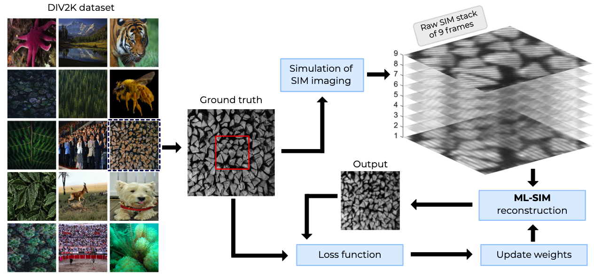

# ML-SIM

**ML-SIM: universal reconstruction of structured illumination microscopy images using transfer learning**

_Charles N. Christensen1,2,*, Edward N. Ward1, Meng Lu1, Pietro Lio2, Clemens F. Kaminski_  
1University of Cambridge, Department of Chemical Engineering and Biotechnology, Laser Analytics Group 
2University of Cambridge, Department of Computer Science and Technology, Artificial Intelligence Group 
 ***Author of this repository**:
- GitHub: [charlesnchr](http://github.com/charlesnchr)
- Email: <code>charles.n.chr@gmail.com</code>
- Twitter: [charlesnchr](https://twitter.com/charlesnchr)

## ML-SIM Publications
### Journal Publication, April 2021
*ML-SIM: universal reconstruction of structured illumination microscopy images using transfer learning*
  [https://doi.org/10.1364/BOE.414680](https://doi.org/10.1364/BOE.414680)

### Pre-print manuscript, March 2020
*ML-SIM: A deep neural network for reconstruction of structured illumination microscopy images*
[https://arxiv.org/abs/2003.11064](https://arxiv.org/abs/2003.11064)

## Web demo
See [https://ML-SIM.github.io](https://ML-SIM.github.io) for examples and test images. A live demo is available at:

## ML-SIM in action
A demonstration of the graphical user interface that has been developed for ML-SIM is shown below. It relies on an engine written in Python using various image libraries for parsing the many formats used in scientific  imaging and Pytorch for deep learning purposes. The functionality of applying ML-SIM in this app is fit for end-users as it stands. More features are planned such as generating new SIM datasets and training new models on those datasets within the app. Over time this software will also be extended with other plugins that rely on deep learning for other image processing tasks. [Read more](#Graphical-desktop-app).

## Status of repository
Code files, Jupyter notebooks and source code for a graphical desktop app have been added. Further documentation, example reconstruction outputs, pre-trained models and snippets to train and evaluate the models reported in the publications are to be added shortly.

### To-do
- Improve graphical application (see separate to-do in sub-project [README](https://github.com/charlesnchr/ML-SIM/tree/master/Graphical-App))
- Add documentation and simple code snippets for training and testing
- Extend to 3D SIM reconstruction
- Incorporate spherical abberrations in simulated SIM data for dataset generation
- Make ImageJ/Fiji plugin
- Open-source the live web app reconstruction at [https://ML-SIM.com](https://ML-SIM.com)
- Publish µManager plugin for real-time reconstruction

## How it works
ML-SIM uses synthetic training data that is simulated based on an physically accurate implementation of the SIM (structured illumination microscopy) imaging process. A deep neural network is trained to solve the inverse problem and with transfer learning it is possible to make the trained model work well on experimental data from the lab.

## Dependencies
- Python 3.6-3.11
- Pytorch 1.4 or newer

For more detailed package versions, please see the *Pipfile* in [Graphical-App](https://github.com/charlesnchr/ML-SIM/tree/master/Graphical-App).

## Layout of repository
- Python scripts for dataset generation, training and testing.
  - The entire pipeline can be started with for example `python MLSIM_pipeline.py --sourceimages_path SRC_IMAGES --out ~/model_out --ntrain 20 --ntest 20 --root auto --task simin_gtout --imageSize 512 --nrep 1 --datagen_workers 4 --model rcan --nch_in 9 --nch_out 1 --ntrain 780 --ntest 20 --scale 1 --task simin_gtout --n_resgroups 2 --n_resblocks 5 --n_feats 48 --lr 0.0001 --nepoch 50 --scheduler 10,0.5 --norm minmax --dataset fouriersim --workers 0 --batchSize 5 --saveinterval 20 --plotinterval 10 --nplot 5 --Nangle 3 --Nshift 3`, where *SRC_IMAGES* are diverse images from ImageNet, [DIV2K](https://data.vision.ee.ethz.ch/cvl/DIV2K/) (used in publication) or similar image sets. To see all options run `python MLSIM_pipeline.py -h` or see the source code.
- Jupyter notebooks for dataset generation, training and testing.
  - _1_PrepareTrainingData_: Simulates the SIM imaging process in order to generate SIM images based on clean source images. This constitutes the training data.
  - _2_Train_: Training
- [Graphical-App](https://github.com/charlesnchr/ML-SIM/tree/master/Graphical-App) (see animation above). A graphical desktop app to use trained ML-SIM models on SIM data based on the Electron framework.
  - More information in separate README in the sub-folder of this repository: [README.md](https://github.com/charlesnchr/ML-SIM/tree/master/Graphical-App)

## Resources
- Pre-trained model for 3x3 SIM images at 512x512 pixel resolution. [Download link](https://ml-sim.s3.eu-west-2.amazonaws.com/pdist/models/DIV2K_randomised_3x3_20200317.pth). See the notebook `3_Evaluate.ipynb` for how to run this pre-trained model.
- DIV2K source image set used for dataset generation for ML-SIM. [Download link](http://data.vision.ee.ethz.ch/cvl/DIV2K/DIV2K_train_HR.zip).

## Web app to test the model
There is an online browser-based ready-to-use implementation available at:
[http://ML-SIM.com](http://ML-SIM.com). The model used in this tool assumes that the inputs are 9 frame SIM stacks of 512x512 resolution; i.e. 3 orientations and 3 phase shifts. It will work for other dimensions, but is unlikely to be good.

## Graphical desktop app
An easy to install and use desktop app for Windows 10, macOS and Linux is available as an Electron app. Instructions and all source code to run the app is given in the sub folder [Graphical-App](https://github.com/charlesnchr/ML-SIM/tree/master/Graphical-App). The program allows one to batch process a set of directories including subdirectories that contain TIFF stacks, and customise and select the model that is used for reconstruction. See screenshot below.

## Credits
- OpenSIM (Matlab code) [https://github.com/LanMai/OpenSIM](https://github.com/LanMai/OpenSIM)
- RCAN (Pytorch model) [https://github.com/yulunzhang/RCAN](https://github.com/yulunzhang/RCAN)
